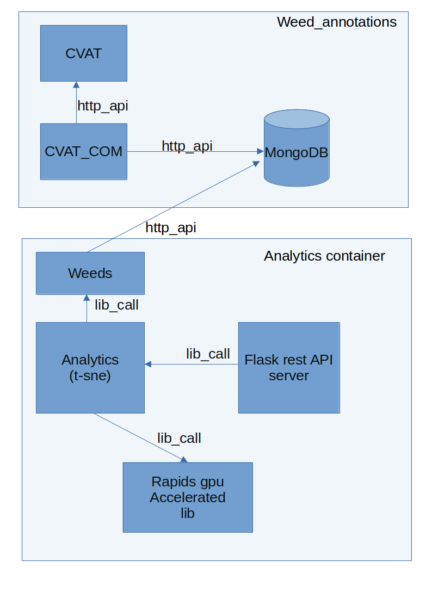

# T-SNE analytics 
- T-distributed Stochastic Neighbour Embedding. PCA-like analysis of dimensionality reduction, applied on featurespace from Resnet101 up until softmax layer. Trained on imagenet. So features are general for imagenet. Do the same analysis on fine tuned network for better class separation. The main idea here is to map clusters of data in feature space and gain insight into feature space distributions.

## Build and run
- First fill in env.list with username, password and other data such as downloaded weed_data path, do not check this in.
- Note that this service also needs access to the downloaded weed_data for analysis.
- For better separation of clusters we use the resnet18 backbone from the model trained on our weed data. Put this model in a folder called model/
- To use the reset18 model fill in `TSNE_MODEL=resnet18` in the env.list file and put follow the next instuction below on model placement. If a standard resnet101 pretrained on imagenet is desired for feature extraction fill in `TSNE_MODEL=standard`
- The pretrained model with backbone used for feature extraction can be found in the artefacts folder on the download server.  
- Build with `sh build_analytics_no_conda.sh` and run with `docker-compose up -d` 
- run_analytics.sh is provided for easier debug but require a manual start of code/app.py. If desired, analytics can also be added to the weed_annotation docker-compose. Analytics should be started before weed_annotations.

## Architecture
The analytics container is built with classes for pandas dataset generation, pytorch dataset class for feature extraction, a t-sne class which holds the pretrained network and the t-sne clustering algorithm. This is held together with a flask http rest api server which handles reqests and servs results.

## Example t-sne graph
